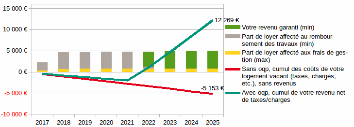

Contrat de valorisation de votre logement vacant

Tout ce que vous devez savoir sur le service oqp (Annexe 1)
===========================================================

Vous êtes propriétaire d'un &lt;xxx&gt; de &lt;xxx&gt;m² situé à &lt;xxx&gt; (&lt;xxx&gt;), à rénover et inoccupé depuis des mois.

D’après nos estimations, ce bien vous coûte actuellement environ &lt;xxx&gt; euros par an (charges, impôts, taxes, entretien/réparations obligatoires) et ne vous rapporte rien.

Pour remplacer ces charges par des revenus, nous mettons à votre service un interlocuteur local unique qui gérera pour vous la rénovation et la mise en location de votre bien. Nous sélectionnons et coordonnons des professionnels locaux qualifiés qui réalisent ces travaux dans un délai maximum de &lt;xxx&gt; mois, pour en faire un logement attractif, confortable et économe en charges :

* &lt;xxx&gt;

* &lt;xxx&gt;

* &lt;xxx&gt;

D'un coût total de &lt;xxx&gt;€ TTC, ces travaux de rénovation augmenteront la valeur de votre bien et accéléreront la vente si vous avez un jour besoin de liquidités. Nous gérons le chantier, nous demandons jusqu'à &lt;xxx&gt;€ d'aides pour vous et nous vous aiderons à défiscaliser jusqu'à 10 700€ de vos revenus par an.

Vous n'avez rien à débourser : oqp finance la rénovation grâce aux premiers loyers encaissés.

À l'approche de la fin des travaux, nous sélectionnons un/e locataire fiable en fixant le loyer à 490€ hors charges. Quelques clauses particulières permettront de garantir le paiement du loyer, en instaurant une relation de confiance et en l'encourageant à s'impliquer dans l'entretien de son logement.

Voici comment sera affecté ce loyer mensuel :

* pour &lt;xxx&gt;€ (85 %) minimum, au remboursement des travaux non couverts par les aides obtenues, puis au versement de votre revenu locatif garanti.
* pour &lt;xxx&gt;€ (15%) maximum, au frais de gestion couvrant notre suivi et nos interventions. Elles sont détaillées et justifiées dans votre espace propriétaire sur oqp en temps réel.

Ce contrat nous engage pour une durée de &lt;xxx&gt; ans, mais vous pouvez le dénoncer sous un mois à tout moment. Si les travaux ne sont pas encore soldés, vous remboursez oqp du solde et récupérez la gestion ou la jouissance de votre bien rénové !

Cette « Annexe 1 » est une présentation simplifiée et illustrée du service que nous vous proposons. Elle synthétise et illustre le contrat, qui seul fait foi.

Article 1. Identité des parties
==============================

&lt;xxx&gt;

domicilié à &lt;xxx&gt;

ci après dénommé « Le Propriétaire »

et

oqp

&lt;xxx&gt;

&lt;xxx&gt;

Représentée par Julien Carnot

ci-après dénommée « oqp »

Article 2. Désignation du bien immobilier et qualité du signataire
=================================================================

Ce contrat vise le bien situé :

&lt;xxx&gt;

&lt;xxx&gt;

&lt;xxx&gt;

 

Le Propriétaire certifie détenir la pleine propriété de ce bien. En cas d'indivision, il joint au présent contrat son mandat exprès ou l'annexe 2, signée par un ou plusieurs indivisaires titulaires d'au moins 2/3 des droits.

Article 3. Objectifs
===================

Ce contrat a pour objectif la remise sur le marché d'un logement inoccupé, intégrant son audit, sa remise en état et son amélioration, en finançant les travaux et les interventions de gestion locative par les revenus issus de la mise en location.

Article 4. Mandat confié à oqp
=============================

Le Propriétaire mandate oqp et ses sous-traitants pour :
* Procéder au débarras du bien, en associant le Propriétaire au choix de la solution d'évacuation et/ou de gardiennage de meubles et du calendrier d'exécution
* Réaliser les audits et diagnostics obligatoires et/ou utiles
* Déterminer puis adapter un niveau de loyer juste dans l'objectif d'optimiser l'occupation du bien
* Souscrire une assurance « Propriétaire non occupant »
* Réaliser toutes demandes d'autorisation de travaux
* Réaliser toutes demandes de financements et leur suivi
* Réaliser les travaux initialement prévus et tous travaux jugés nécessaires pour la bonne exécution du contrat
  * en sélectionnant les prestataires ou sous-traitants mieux-disants, selon des critères qualitatifs, économiques, écologiques et sociaux
  * en coordonnant leur intervention
  * en contrôlant la conformité des travaux et en prononçant leur réception
  * en engageant toute démarche de nature à obtenir réparation de tout préjudice
* Organiser les visites et sélectionner les locataires au vu de la qualité de leur dossier, mais aussi de leur situation et de leur projet, dans l'objectif de sécuriser le paiement des loyers tout au long du bail et d'assurer l'entretien du logement rénové
* Préparer les baux pour leur signature et réaliser les états des lieux
* Gérer l'encaissement du dépôt de garantie et loyers puis engager toute démarche de nature à garantir le bon paiement du loyer sur la durée, par des voies amiables ou contentieuses
* Suivre la gouvernance de la copropriété le cas échéant
* Établir un état détaillé des revenus fonciers pour préparer et optimiser la déclaration de revenus du Propriétaire (déduction des frais et charges, déficit foncier, etc.).
* Gérer toute la relation avec les locataires : gestion des demandes, prévention et remédiation des problèmes matériels ou économiques

Article 5. Engagements du Propriétaire
=====================================

Le Propriétaire s'engage à laisser entière latitude à oqp et à ses sous-traitants pour réaliser les objectifs listés à l'Article 3. La signature dans un délai de 5 jours ouvrés suivant leur transmission de demandes, baux, contrats ou actes relevant de cette mission relève de l'exécution de ses obligations contractuelles.

Le Propriétaire prend également les engagements suivants vis à vis des locataires, à travers les clauses particulières du bail, pour créer une relation de confiance durable et les inciter à s'impliquer dans l'entretien et la valorisation de leur logement :

* S'il souhaite vendre son bien, le Propriétaire s'engage à faire aux locataires une offre de vente au prix du marché réduit d'1 % par année au pro-rata temporis de leur durée d'occupation
* Le Propriétaire autorise expressément les locataires à sous-louer tout ou partie de leur logement pour une durée maximale de 60 nuits par an, sous réserve de réaliser toutes les démarches exigées par la législation en vigueur (déclaration en mairie, reversement de la taxe de séjour, etc.)
* Le Propriétaire pourra consentir une baisse temporaire de loyer si des locataires démontrent l'opportunité et la capacité technique de réaliser des travaux supplémentaires d'amélioration du logement

Article 6. Financement des travaux
=================================

Les travaux initiaux sont financés par :

* les aides publiques et/ou privées obtenues
* les premiers loyers encaissés

Le plan de financement contractuel est disponible sur l'espace Propriétaire du site oqp. Il récapitule les montants des travaux payés, des aides obtenues et des revenus locatifs affectés au remboursement.

Le taux d'intérêt légal applicable aux entreprises non financières est appliqué annuellement au solde restant à rembourser, venant actualiser l'échéancier.

Si au cours du contrat, d'autres travaux s'avèrent nécessaires, oqp proposera au Propriétaire un avenant avec un nouvel échéancier, sur le même modèle.

Article 7. Loyers, revenu locatif et frais de gestion
====================================================

Les loyers perçus sont affectés :

* à 85 % minimum
  * au remboursement des travaux, puis
  * au versement du revenu locatif au Propriétaire une fois que les travaux sont remboursés
* à 15 % maximum
  * au paiement des interventions d'oqp ou de ses sous-traitants

À chaque fin de mois, le Propriétaire reçoit son revenu locatif net des déductions des interventions de gestion. Celles-ci sont sont listées, justifiées et chiffrées dans l'espace Propriétaire sur oqp.io.

Le revenu du Propriétaire sera toujours supérieur ou égal à 85 % du loyer : dans l'éventualité où le coût des interventions dépasse 15 % du loyer au mois de leur exécution, le solde est déduit des loyers suivants.

Article 8. Garantie du revenu locatif
====================================

oqp assume le risque de la vacance et des impayés et garantit le versement mensuel du revenu locatif à compter de la fin de remboursement des travaux, que des locataires soient en place et/ou à jour du paiement de leur loyer ou non.

Article 9. Durée du contrat
==========================

Ce contrat engage les parties pour une durée de &lt;xxx&gt; ans à compter de sa signature.

Il pourra être reconduit par avenant.

Article 10. Rupture de contrat
=============================

Le Propriétaire peut dénoncer par écrit à tout moment ce contrat sous un préavis d'un mois.

La rupture du contrat prend effet lorsque le Propriétaire a soldé l'ensemble des sommes engagées au titre des travaux et des interventions de gestion restant à financer. oqp met alors tout en œuvre pour que la gestion soit reprise par le Propriétaire ou par son mandataire dans les meilleures conditions.

Article 11. Modalités d'information et d'échanges
================================================

Toutes les informations sur la remise sur le marché et la gestion du bien sont disponibles en temps réel sur l'espace Propriétaire du site internet oqp. Pour favoriser la traçabilité des échanges et participer à l'amélioration de la qualité du service rendu, le Propriétaire s'engage à privilégier l’usage de la messagerie électronique et à accéder à ses informations sur l'espace Propriétaire.

Le Propriétaire autorise oqp à conserver toutes les données nécessaires à la conduite de ses missions et à publier des données non personnelles ou anonymisées pouvant intéresser le public.

Article 12. Représentation au sein de la SCIC oqp
================================================

Le Propriétaire est invité à devenir sociétaire de la société coopérative d'intérêt collectif oqp, pour participer à sa gouvernance et à son développement.

Article 13. Garantie financière et responsabilité civile professionnelle
=======================================================================

oqp et ses sous-traitants sont couvert par une garantie financière contractée auprès de &lt;xxx&gt; et par un contrat de responsabilité civile professionnelle souscrit auprès de &lt;xxx&gt;.

Signé électroniquement par

le Propriétaire : 

oqp :
